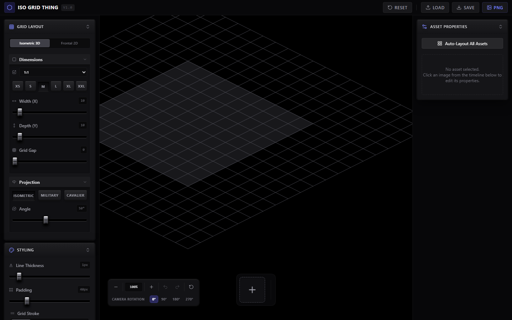
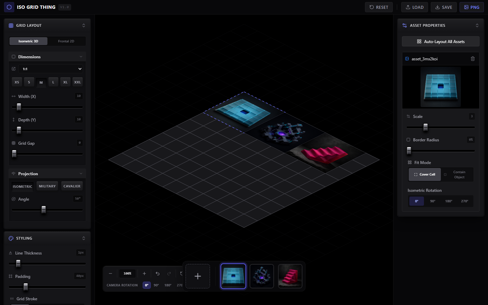
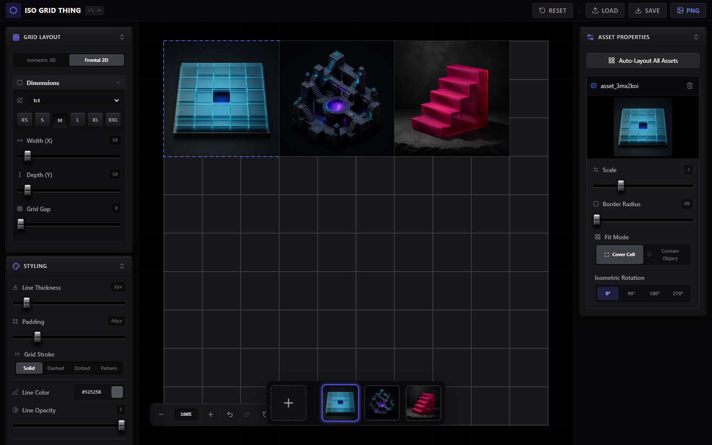
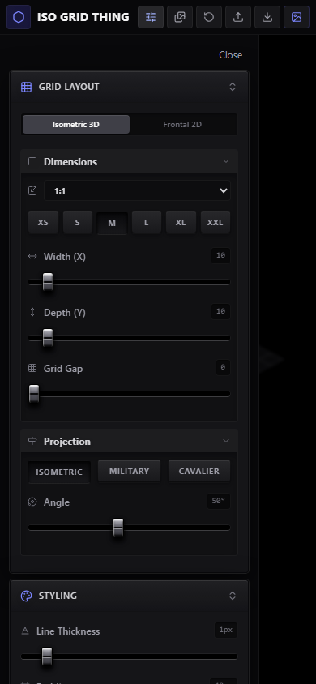

<p align="center">
  <picture>
    <source media="(prefers-color-scheme: dark)" srcset="https://shieldcn.dev/header/grid.svg?title=Iso+Grid+Thing&subtitle=Build+isometric+grids,+arrange+local+media,+and+export+portable+workspaces&logo=react&theme=violet&align=center&mode=dark" />
    
  </picture>
</p>

<p align="center">
  <a href="https://github.com/gvastethecreator/iso-grid-thing/actions/workflows/ci.yml"></a>
  <a href="https://github.com/gvastethecreator/iso-grid-thing/stargazers"></a>
  <a href="https://github.com/gvastethecreator/iso-grid-thing/commits/main"></a>
  <a href="https://gvastethecreator.github.io/iso-grid-thing/"></a>
</p>

<p align="center">
  A client-only React workspace for isometric and frontal grids, local media layouts, and portable exports.
  <br />
  <a href="https://gvastethecreator.github.io/iso-grid-thing/"><strong>Open the live app</strong></a>
</p>

## Product tour

| Isometric workspace                                                                                                        | Media layout and controls                                                                                                    |
| -------------------------------------------------------------------------------------------------------------------------- | ---------------------------------------------------------------------------------------------------------------------------- |
|  |  |
| **Frontal 2D mode**                                                                                                        | **Mobile settings**                                                                                                          |
|                |            |

## What it does

- Builds isometric and frontal 2D grids with editable dimensions, projection, rotation, padding, colors, opacity, and line styles.
- Places local images and videos with drag, scale, fit, rotation, radius, timeline selection, and automatic layout.
- Supports pan, zoom, undo, redo, keyboard shortcuts, and responsive side panels.
- Exports PNG images and portable JSON workspaces with embedded media.
- Keeps imported media inside the browser session. The app has no backend service.

## Quick start

Install Node.js 24 or newer and pnpm 11.21 or newer.

```sh
pnpm install
pnpm run dev
```

Open `http://127.0.0.1:5173`.

## Commands

```sh
pnpm run dev           # local development
pnpm run check         # format, lint, types, and unit tests
pnpm run ci            # full check, production build, and Chromium tests
pnpm run deps:outdated # available dependency updates
pnpm run deps:audit    # dependency security audit
```

VS Code exposes the same common commands in `.vscode/tasks.json`.

## Documentation

- [Setup and deployment](docs/setup.md)
- [Architecture](docs/architecture.md)
- [Dependency upgrade notes](docs/dependencies.md)
- [Performance](docs/performance.md)
- [Product requirements](docs/product-requirements.md)
- [Project readiness](docs/project-readiness.md)
- [Technical debt](docs/technical-debt.md)

## Status

- pnpm is the only supported package manager.
- The application does not require Bun, environment variables, or a backend.
- GitHub Pages deploys the production build from the `main` branch.
- No open-source license has been selected. All rights remain reserved.

## Support

<p align="center">
  <a href="https://github.com/sponsors/gvastethecreator"></a>
</p>

Support continued development through [GitHub Sponsors](https://github.com/sponsors/gvastethecreator) or [Ko-fi](https://ko-fi.com/gvaste).
